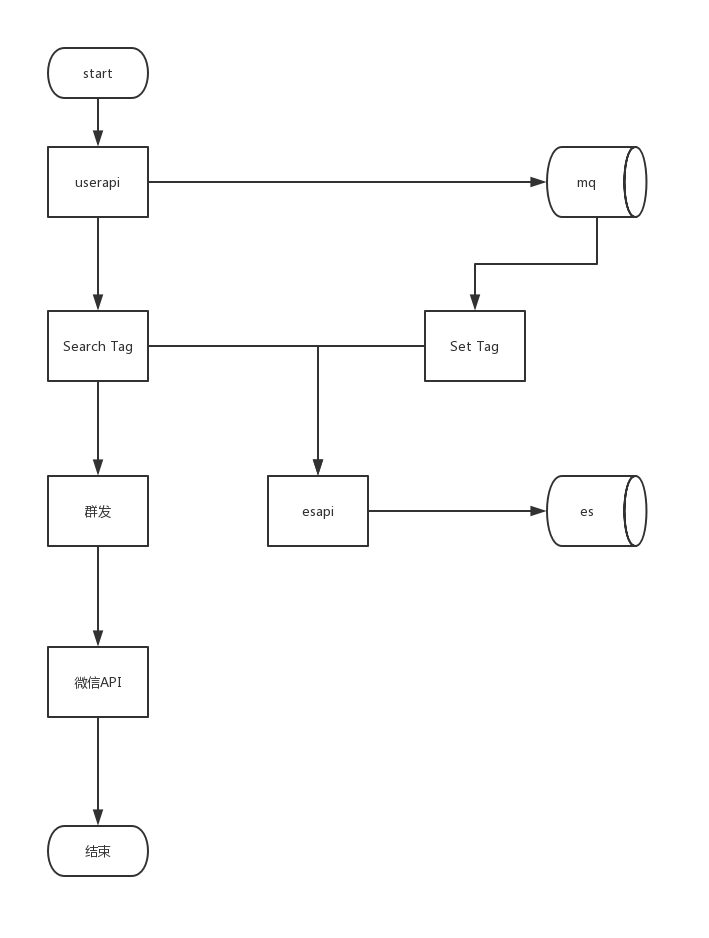

# <a name="top">2月第三周，18-23</a> 

- 日期: 20190222

|ID|任务|交付|对接|备注|
|----|----|----|----|----|
|1|redis集群修改活动模块和会员模块调用|<a href="#task1" target="_self">活动模块和用户模块代码</a>|达威| |
|2|redis集群提交测试|<a href="#task2" target="_self">技术测试方案</a>|达威->丁亮| |
|3|标签技术选型|<a href="#task3" target="_self">标签技术选型方案</a>|达威<->周瑜| |
|4|标签业务数据流转流程图|<a href="#task4" target="_self">标签业务数据流转流程图</a>|达威<->李洋/周瑜| |
|5|标签模块划分|<a href="#task5" target="_self">标签模块划分</a>|达威<->周瑜| |
|6|标签模块的产品需求会|<a href="#task6" target="_self">需求问题list</a>|达威| |
|----|----|----|----|----|


- 日期: 20190221

|ID|任务|交付|对接|备注|
|----|----|----|----|----|
|1|redis集群修改活动模块和会员模块调用|<a href="#task1" target="_self">活动模块和用户模块代码</a>|达威| |
|2|redis集群提交测试|<a href="#task2" target="_self">技术测试方案</a>|达威->丁亮| |
|3|标签技术选型|<a href="#task3" target="_self">标签技术选型方案</a>|达威<->周瑜| |
|4|标签业务数据流转流程图|<a href="#task4" target="_self">标签业务数据流转流程图</a>|达威<->李洋/周瑜| |
|----|----|----|----|----|

- 日期: 20190220

|任务ID|任务|交付|对接|备注|
|----|----|----|----|----|
|1|redis集群提交测试|<a href="#task2" target="_self">技术测试方案</a>|达威->丁亮| |
|2|标签技术选型|<a href="#task3" target="_self">技术点列表</a>|达威<->周瑜| |
|----|----|----|----|----|

# 任务详情

- <a href="#top" target="_self">返回->顶部</a>

## <a name="task1">交付1 : 活动模块和用户模块代码</a>

- 添加predis包到活动代码库，修改composer.json，然后更新
```json
"predis/predis": "^1.1"
```
- 


## <a name="task2">交付2 : 技术测试方案</a>

- 测试方案，<a href="task-redis集群测试.md" download="task-redis集群测试.md">[代码接口调试方案]</a>

|测试点|测试结果|测试方案|备注|
|----|----|----|----|
|用户自动登陆/手动登陆|用户数据正常|直接测试|[测试地址](http://checkm.juewei.com/views/activity/index.html)  |
|用户自动登陆/手动登陆|redis集群数据正常|直接测试| |
|用户自动登陆/手动登陆|redis集群数据正常|停掉一个主节点后直接测试| |
|用户自动登陆/手动登陆|redis集群数据正常|停掉一个从节点后直接测试| |
|用户自动登陆/手动登陆|redis集群数据正常|停掉不关联的一个主和一个从节点，后直接测试| |
|用户自动登陆/手动登陆|redis集群数据不正常|停掉关联的一个主和一个从节点，后直接测试| |
|用户自动登陆/手动登陆|redis集群数据不正常|停掉关联的一个主和一个从节点，后直接测试| |
|bi后台会员操作|用户数据正常|直接测试| [测试地址](http://checkbi.juewei.com/views/activity/index.html) |
|bi后台会员操作|redis集群数据正常|直接测试| |
|bi后台会员操作|redis集群数据正常|停掉一个主节点后直接测试| |
|bi后台会员操作|redis集群数据正常|停掉一个从节点后直接测试| |
|bi后台会员操作|redis集群数据正常|停掉不关联的一个主和一个从节点，后直接测试| |
|bi后台会员操作|redis集群数据不正常|停掉关联的一个主和一个从节点，后直接测试| |
|bi后台会员操作|redis集群数据不正常|停掉关联的一个主和一个从节点，后直接测试| |
|引流会员注册|用户数据正常|直接测试| [测试地址](http://checkwap.juewei.com/views/activity/index.html) |
|引流会员注册|redis集群数据正常|直接测试| |
|引流会员注册|redis集群数据正常|停掉一个主节点后直接测试| |
|引流会员注册|redis集群数据正常|停掉一个从节点后直接测试| |
|引流会员注册|redis集群数据正常|停掉不关联的一个主和一个从节点，后直接测试| |
|引流会员注册|redis集群数据不正常|停掉关联的一个主和一个从节点，后直接测试| |
|引流会员注册|redis集群数据不正常|停掉关联的一个主和一个从节点，后直接测试| |
|摇券|用户数据正常|直接测试| [测试地址](http://checkwap.juewei.com/views/activity/index.html) |
|摇券|redis集群数据正常|直接测试| |
|摇券|redis集群数据正常|停掉一个主节点后直接测试| |
|摇券|redis集群数据正常|停掉一个从节点后直接测试| |
|摇券|redis集群数据正常|停掉不关联的一个主和一个从节点，后直接测试| |
|摇券|redis集群数据不正常|停掉关联的一个主和一个从节点，后直接测试| |
|摇券|redis集群数据不正常|停掉关联的一个主和一个从节点，后直接测试| |
|----|----|----|----|

- 测试中使用的redis命令
 - 连接集群
```sh
/usr/local/bin/redis-cli -p 6101 -c -a 86962983
```
 - 停服务，下面例子停6101端口服务
```sh
/etc/init.d/redis stop 6101
```

 - 启动服务
```sh
/etc/init.d/redis start 6101
```

 - 查询集群信息，连接集群后输入下面命令
```sh
cluster nodes
```
   集群信息输出例如：
   master表示主redis，slave表示从redis；
   6101端口和6105端口互为主从，依据关系id：a18d61c1a0703c17e79a17bd078b4f0646738b8f；
```sh
c65a72adc4e270b465f3e600eb88effae8355d3b 172.30.0.91:6105@16105 slave a18d61c1a0703c17e79a17bd078b4f0646738b8f 0 1550631445491 5 connected
5c4064c6ce9bd22efb1a5bb0a38b5f666cda302c 172.30.0.91:6104@16104 slave 6185c0fc5aeace3c33b1e840e3715b9ece563d50 0 1550631444489 4 connected
528dca3f57fdf184df2cba0852b036d7d6669d10 172.30.0.91:6106@16106 slave 834fc93d2891bf324fdb035b63d75b89318c16d8 0 1550631444000 6 connected
6185c0fc5aeace3c33b1e840e3715b9ece563d50 172.30.0.91:6103@16103 master - 0 1550631444000 3 connected 10923-16383
834fc93d2891bf324fdb035b63d75b89318c16d8 172.30.0.91:6102@16102 master - 0 1550631443000 2 connected 5461-10922
a18d61c1a0703c17e79a17bd078b4f0646738b8f 172.30.0.91:6101@16101 myself,master - 0 1550631442000 1 connected 0-5460
```
 - 查询数据
```sh
get user:openid_to_userid:{openid}
get user:info:{user_id}
get user:phone_to_userid:{phone}
```
 - 删除数据
```sh
del user:openid_to_userid:{openid}
```

## <a name="task3">交付3 : 标签技术选型方案</a>

### 微信公众号开放平台相关文档

- accesstoken维护
   - 第三方授权
   - 普通授权
- 用户标签管理-[官方文档](https://mp.weixin.qq.com/wiki?t=resource/res_main&id=mp1421140837)
   - 一个公众号，最多可以创建100个标签
   - 标签名（30个字符以内）
   - 某个标签下的粉丝超过10w时，先进行取消标签的操作，直到粉丝数不超过10w后，才可直接删除该标签
- 粉丝标签
   - 用户打上最多20个标签
   - 批量打标签一次最多50个openid

- 群发接口和原创校验-[官方文档](https://mp.weixin.qq.com/wiki?t=resource/res_main&id=mp1481187827_i0l21)
   - 高级群发接口的每日调用限制为100次，用户每月只能接收4条
   - 群发接口每分钟限制请求60次
   - 参数is_to_all=true一个月最多只能4次
- 素材管理-[官方文档](https://mp.weixin.qq.com/wiki?t=resource/res_main&id=mp1444738734)
- 图文分析数据接口-[官方文档](https://mp.weixin.qq.com/wiki?t=resource/res_main&id=mp1421141084)
   - 仅存储了2014年12月1日之后的数据
   - 每天上午8点后查询公众号前一天的数据
   -

- 个性化自定义菜单
   - 个性化自定义菜单可以利用用户标签，当用户身上的标签超过1个时，以最后打上的标签为匹配 

### 标签业务模块

- elasticsearch 服务 
   - 一个index只能有一个type,7.0版本以后就完全抛弃type了
   - 测试服务：
```sh
curl -H "Content-Type: application/json" -XGET http://172.30.0.97:9200/test/people/_count?pretty -d '{"query":{"bool":{"must":[{"term":{"tag_id":"mkit"}},{"term":{"tag_id":"iutj"}}]}}}'
```
- elasticsearch es-api接口层 [git地址](http://dawei@git.juewei.com/scm/jwd/es-api.git)
   - 设计es接口层，提供es基础服务接口
   - ！提供接口文档
- 标签服务层 [git地址](http://dawei@git.juewei.com/scm/jwd/userapi.git)
   - 设计为标签服务层
   - ！提供接口文档
- 打标签 [git地址](http://dawei@git.juewei.com/scm/jwd/userapi.git)
   - 全量标签初始化，脚本，多php进程分用户数据打标签
      - ！从库ip：
   - 同步标签，利用队列异步给用户打标签，扩展区分微信标签和本地标签
      - ！队列服务：
      - 同步用户里面的微信用户标签，es存储用户里面的微信用户数据
   - 

## <a name="task4">交付4 : 标签业务数据流转流程图</a>

- <center></center>


## <a name="task5">交付5 : 标签模块划分</a>

|模块|任务|工期|执行者|交付|备注|
|----|----|----|----|----|-----|
|es基础服务|||| ||
||es数据库||王增辉|es数据库服务/服务地址| |
||esapi git仓库||王增辉|仓库地址| |
||esapi||周瑜|接口文档/接口层设计说明||
|微信基础服务||||| |
||微信token维护|||| |
||微信素材同步|||| |
||微信群发|||| |
||微信图文数据统计|||| |
||微信标签|||| |
||微信用户|||| |
||微信同步消息|||| |
|||||| |
|用户标签业务服务||||| |
||打用户标签|||| |
|群发业务服务||||| |
||群发列表|||| |
||标签搜索|||| |
||群发发送|||| |
|素材业务服务||||| |
||素材列表|||| |
|||||| |
|----|----|----|----|-----|----|

## <a name="task6">交付6 : 需求问题list</a>

- 数据统计的维度
- 注册渠道：二维码渠道（有分公司id，全国无分公司id），
- 一个用户一个分公司标签
- 定位，m站定位（目前没有存储）
- 群发发送需要授权

## 问题
- 
- 
